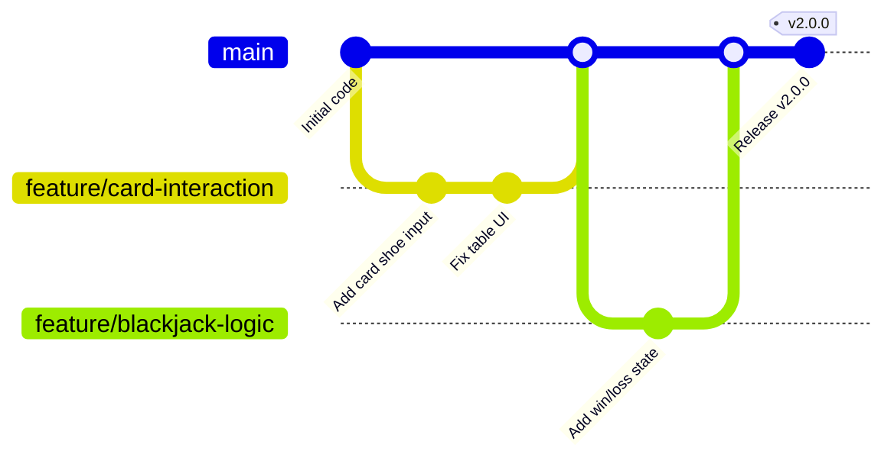

# Development Process

## Issue-linked PR workflow

Our development process uses issue-linked branches and pull requests to ensure traceability and review control. Every new piece of work starts from a GitHub Issue or Product Backlog item. The developer creates a feature branch from `main`, names it after the issue or feature, and links the branch and PR back to the issue. This provides a clear chain from the backlog item to the code changes.

The branch is developed with small commits, then a Pull Request is opened against `main`. The PR description includes the related issue number, acceptance criteria, testing notes, and a checklist of required evidence. A second team member reviews the PR, verifies the changes, and confirms that the issue is resolved before merge.

Once the work is approved, the branch is merged into `main`. The issue is closed only after the merge is complete and any release or documentation updates are recorded.

## Git workflow diagram

