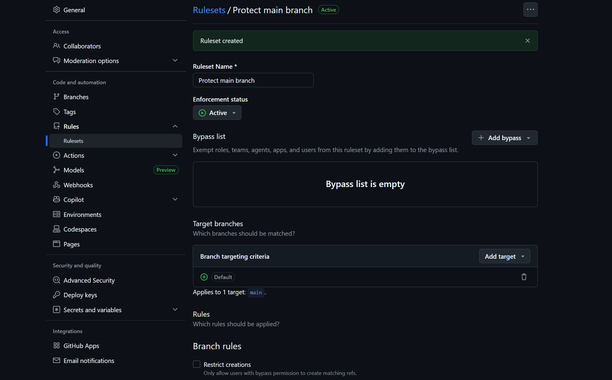
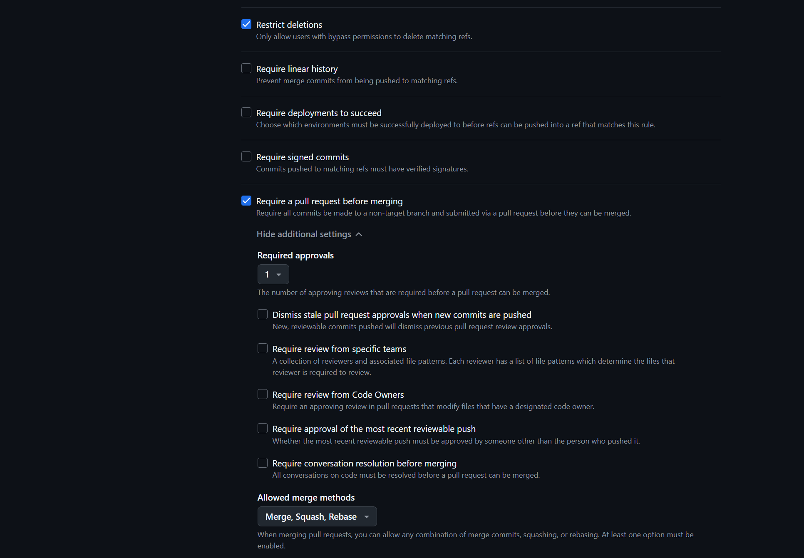
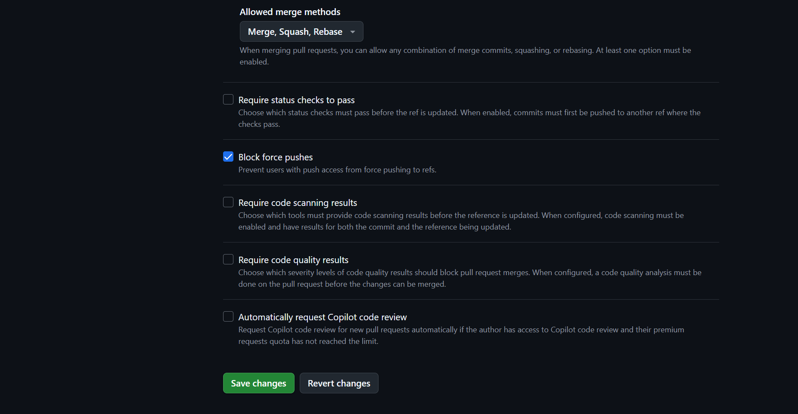
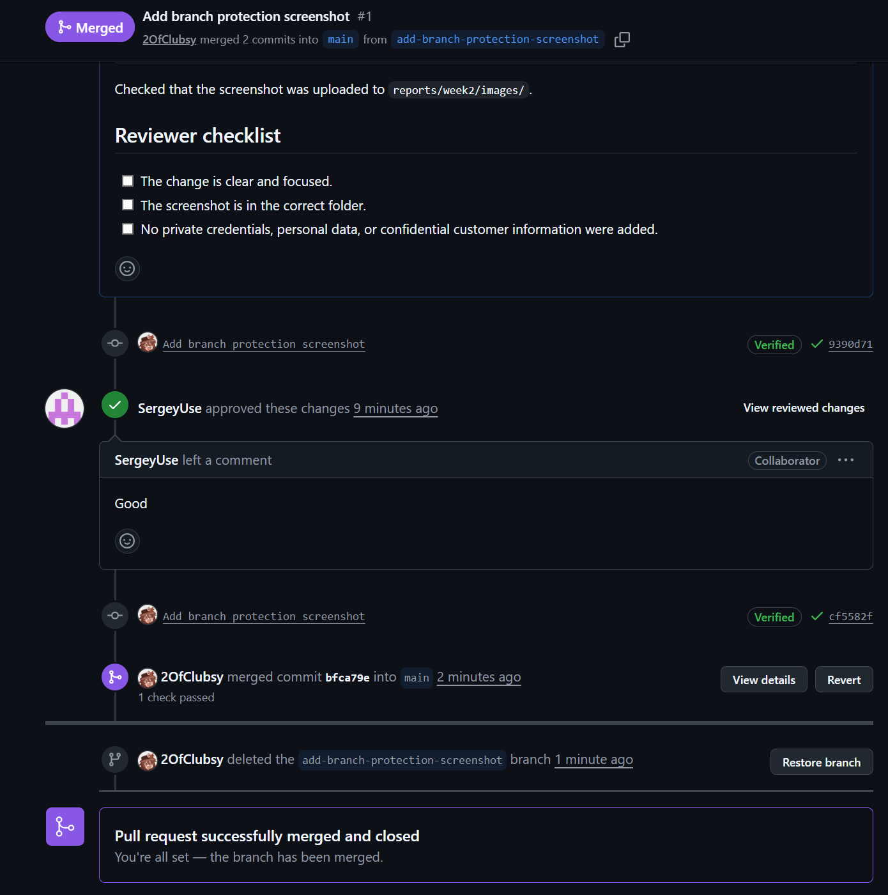

# Week 2 Report

This file is the public index for the Assignment 2 submission.

## Project

**Project name:** Card Duel Project

**Description:** A card-based duel game prototype for a course project.

**License:** [MIT License](../../LICENSE)

---

## User stories

- [User stories](user-stories.md)

---

## Prototype and interface artifacts

To be added after the interactive prototype is prepared.

---

## MVP v0

- [MVP v0 report](mvp-v0-report.md)
- [MVP v0 Windows build archive](https://drive.google.com/drive/folders/1P3rSPIW-Alx3KcsHDx0HcvqGbo66a9ZR?usp=sharing)
- [Public MVP v0 video demonstration](https://drive.google.com/file/d/18vIMUVs3uTnxOA45d65Y24t4WqTotlsf/view?usp=sharing)
- [Local setup instructions](../../README.md)

---

## PR/MR workflow

- [Pull Request template](../../.github/pull_request_template.md)
- [Example reviewed Pull Request](https://github.com/2OfClubsy/card-duel-project/pull/2)

---

## Link checking

- [Lychee configuration](../../lychee.toml)
- [Latest successful Lychee run](https://github.com/2OfClubsy/card-duel-project/actions/runs/27354984303)

---

## Lychee excluded links

The following links were excluded from automated Lychee checking:

- Figma prototype links, because Figma preview links may be unstable for automated link checkers.
- YouTube video links, because video hosting pages may block automated link checkers.

All excluded links will be manually verified before submission.

---

## Screenshots

### Protected default branch

### Example reviewed PR

### Prototype

To be added after the prototype screenshot is prepared.

### MVP v0

To be added after MVP v0 is deployed or prepared.

---

## Coverage

To be completed after the final initial proposed MVP v1 scope, prototype, and MVP v0 are prepared.

---

## Customer review

- [Customer meeting transcript](customer-meeting-transcript.md)
- [Customer meeting notes](customer-meeting-notes.md)
- [Customer meeting summary](customer-meeting-summary.md)

The final publication status of the transcript will be updated after customer permission is confirmed.

---

## Week 2 analysis

- [Week 2 analysis](analysis.md)

---

## LLM usage

- [LLM usage report](llm-report.md)
