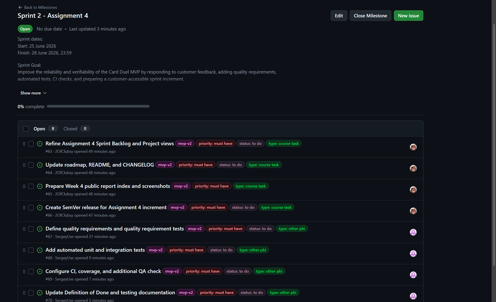
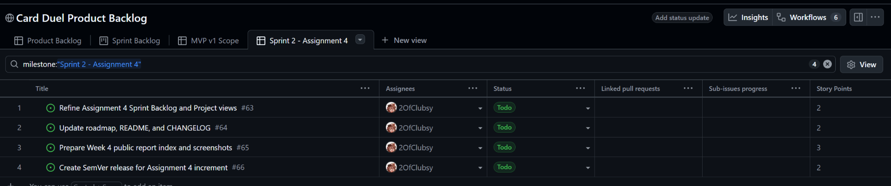
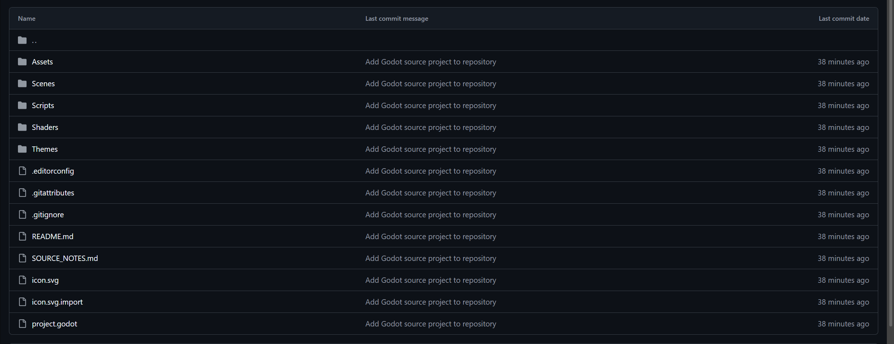
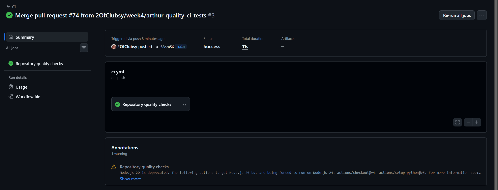
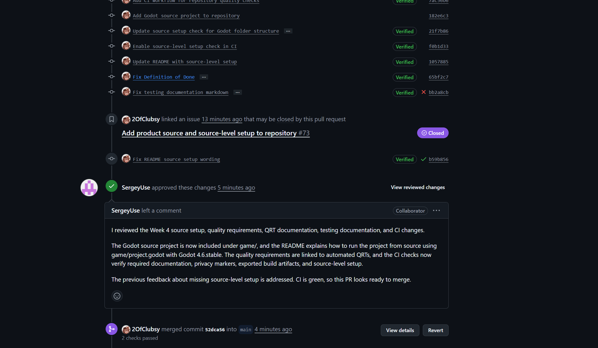

# Week 4 Report — Card Duel Project

## Project name

Card Duel Project

## Short description

Card Duel Project is a 3D card-duel prototype inspired by dark tabletop card-game experiences. The project focuses on a clear lobby-to-table flow, a playable card-duel setup, customer feedback response, and maintained quality evidence.

## Team

Team #31

| Team member | GitHub username | Main Week 4 responsibility |
|---|---|---|
| Arthur | `2OfClubsy` | GitHub setup, Sprint planning, roadmap, report index, release evidence |
| Sergey | `SergeyUse` | Quality requirements, automated tests, CI, coverage, QA checks |
| Danil | `egg1245` | Customer feedback, UAT, customer review evidence, reflection, retrospective |

---

## Product and Sprint links

| Evidence | Link |
|---|---|
| Product Backlog view | [Product Backlog](https://github.com/users/2OfClubsy/projects/1/views/1) |
| Sprint Backlog view | [Sprint 2 - Assignment 4](https://github.com/users/2OfClubsy/projects/1/views/4) |
| Assignment 4 Sprint milestone | [Sprint 2 - Assignment 4 milestone](https://github.com/2OfClubsy/card-duel-project/milestone/3) |
| Roadmap | [docs/roadmap.md](../../docs/roadmap.md) |
| Definition of Done | [docs/definition-of-done.md](../../docs/definition-of-done.md) |
| Quality requirements | [docs/quality-requirements.md](../../docs/quality-requirements.md) |
| Quality requirement tests | [docs/quality-requirement-tests.md](../../docs/quality-requirement-tests.md) |
| Testing documentation | [docs/testing.md](../../docs/testing.md) |

---

## Sprint summary

| Field | Value |
|---|---|
| Sprint | Sprint 2 - Assignment 4 |
| Sprint dates | 25 June 2026 - 28 June 2026, 23:59 |
| Sprint Goal | Improve the reliability and verifiability of the Card Duel MVP by responding to customer feedback, adding quality requirements, automated tests, CI checks, and preparing a customer-accessible sprint increment. |
| Sprint size | 30 Story Points planned |
| Sprint milestone | [Sprint 2 - Assignment 4 milestone](https://github.com/2OfClubsy/card-duel-project/milestone/3) |
| Sprint Backlog | [Sprint 2 - Assignment 4 Project view](https://github.com/users/2OfClubsy/projects/1/views/4) |

## Sprint scope summary

The Assignment 4 Sprint focuses on improving the reliability and verifiability of the MVP instead of only increasing the number of implemented gameplay features.

Selected Sprint work includes:

- responding to customer feedback from the MVP v1 review;
- defining quality requirements;
- defining automated quality requirement tests;
- adding automated unit and integration tests;
- configuring CI quality gates;
- updating the Definition of Done;
- updating testing documentation;
- preparing UAT scenarios and Week 4 execution evidence;
- conducting customer UAT and Sprint Review;
- preparing a public sanitized demo video;
- preparing a new SemVer release for the Assignment 4 Sprint increment.

---

## Delivered product changes

The Assignment 4 / MVP v2 Sprint increment delivered both product progress and quality evidence.

Compared to MVP v1, the team showed the customer the following MVP v2 progress:

- pause menu;
- ability to select cards from the table;
- foundation for a blackjack system.

The blackjack system is not fully playable yet. It is documented as follow-up work and should not be presented as a fully completed gameplay feature.

The Sprint also delivered:

- Godot source project under `game/`;
- source-level setup instructions in the root `README.md`;
- quality requirements;
- quality requirement tests;
- testing documentation;
- updated Definition of Done;
- repository quality check script;
- automated tests for repository quality checks;
- CI checks for required documentation, privacy markers, exported build artifacts, and source-level setup;
- Week 4 customer UAT results;
- customer review notes and summary;
- reflection, retrospective, and LLM usage report;
- `v0.2.0` SemVer release.

---

## Deployment, release, and access

| Evidence | Link |
|---|---|
| Runnable product source | [game/project.godot](../../game/project.godot) |
| Current run instructions | [README.md](../../README.md) |
| SemVer release | [v0.2.0 - Assignment 4 / MVP v2 Increment](https://github.com/2OfClubsy/card-duel-project/releases/tag/v0.2.0) |
| Changelog | [CHANGELOG.md](../../CHANGELOG.md) |
| Public sanitized demo video and product archive | [Card Duel Project v0.2.0 Week 4 Demo and Archive](https://drive.google.com/drive/folders/11zMskWm4cS25pYxuM-SGSfuZunUNJ0_x) |

---

## Customer feedback response

| Feedback point | Resulting PBI or issue | Status | Response |
|---|---|---|---|
| The customer approved the 3D card-duel direction and MVP v1 scope during the Week 3 review. | Sprint 2 - Assignment 4 milestone — TODO: add link | In progress | The Sprint continues the approved 3D direction and improves reliability, verification, and evidence. |
| The customer suggested that art references could be added later for a more complete visual direction. | TODO: link backlog item or issue if created | Deferred | This was treated as useful future visual refinement, but the current Sprint prioritizes quality, CI, tests, UAT, and release evidence. |
| The customer needs a customer-accessible increment for review and UAT. | TODO: link release/build issue | In progress | The team prepares a new SemVer release, run instructions, and UAT scenarios for the customer review. |

## Feedback not addressed in this Sprint

The optional art references improvement is not the main focus of the Assignment 4 Sprint. It is deferred because quality automation, UAT, CI, and maintained verification evidence are higher-priority Sprint risks.

---

## Quality model

The team uses ISO/IEC 25010 quality characteristics and sub-characteristics to define measurable quality requirements.

Selected Week 4 quality requirements will use at least three different ISO/IEC 25010 sub-characteristics.

| Quality requirement | ISO/IEC 25010 sub-characteristic | Automated QRT |
|---|---|---|
| QR-01 — Source-level project availability | Maintainability / Modularity | QRT-01 — Repository source-level setup check |
| QR-02 — Public evidence privacy safety | Security / Confidentiality | QRT-02 — Public evidence privacy check |
| QR-03 — Customer-facing documentation completeness | Usability / Appropriateness recognizability | QRT-03 — Required documentation presence check |

See:

- [Quality requirements](../../docs/quality-requirements.md)
- [Quality requirement tests](../../docs/quality-requirement-tests.md)
---

## Testing status summary

TODO: update after Sergey completes testing and CI work.

| Test / check type | Status | Evidence |
|---|---|---|
| Unit tests | Passed | Repository quality check unit tests passed in CI |
| Integration tests | Passed with repository-level checks | Repository documentation, privacy, artifact, and source setup checks passed together in CI |
| Automated quality requirement tests | Passed | QRT-01, QRT-02, and QRT-03 are covered by repository quality checks |
| Coverage for critical modules | Documented limitation | Repository checks are covered by unit tests; Godot gameplay line coverage is planned follow-up work |
| Additional QA check | Passed | Public evidence wording / privacy marker check passed |
| CI pipeline | Passed | Repository quality checks passed in GitHub Actions |

## Critical modules and coverage

| Critical module | Coverage expectation | Current status |
|---|---:|---|
| TODO | At least 30% line coverage | TODO |
| TODO | At least 30% line coverage | TODO |

## Test links

| Evidence | Link |
|---|---|
| Unit tests | GitHub Actions — Repository quality checks |
| Integration tests | GitHub Actions — Repository quality checks |
| Automated quality requirement tests | [docs/quality-requirement-tests.md](../../docs/quality-requirement-tests.md) |
| CI pipeline | TODO: add final CI run link |
| Latest protected-default-branch CI run | TODO: add final main branch CI run link after all PRs are merged |
| Branch protection or rules evidence | TODO: add screenshot or link if available |

---

## CI, quality gates, and continued governance

Assignment 4 quality gates are maintained project assets. Later work should keep these checks active instead of bypassing or removing them.

Future PBIs should continue to follow the updated Definition of Done:

- acceptance criteria must be verified;
- pull requests must be reviewed by another team member;
- required CI checks must pass before merge;
- relevant automated tests must pass;
- relevant automated quality requirement tests must pass;
- coverage expectations for critical modules must be maintained or updated with explanation;
- testing evidence must be preserved in PRs, CI, or linked documentation;
- user-visible changes must be reflected in the changelog.

See:

- [Definition of Done](../../docs/definition-of-done.md)
- [Testing documentation](../../docs/testing.md)

## Customer Sprint Review

| Evidence | Link |
|---|---|
| Customer review summary | [customer-review-summary.md](customer-review-summary.md) |
| Customer review notes | [customer-review-notes.md](customer-review-notes.md) |
| User acceptance tests | [docs/user-acceptance-tests.md](../../docs/user-acceptance-tests.md) |

Private customer recording links, exact private timecodes, credentials, university emails, and customer-identifying evidence are not committed to the public repository.

The Week 4 customer session was conducted offline face-to-face. The team used sanitized written notes as public evidence.

## Customer UAT and Sprint Review

The Week 4 customer UAT and Sprint Review was conducted offline face-to-face.

The customer reviewed the Sprint Backlog and generally approved it. The customer also completed all three prepared UAT scenarios without blocking issues.

Customer approval status: **Approved with minor comments**.

The main follow-up request is to complete the blackjack gameplay system before presenting it as a fully working MVP v2 feature.

See:

- [User acceptance tests](../../docs/user-acceptance-tests.md)
- [Customer review summary](customer-review-summary.md)
- [Customer review notes](customer-review-notes.md)

## UAT results

| Scenario | Result | Summary |
|---|---|---|
| UAT-01 — Start the prototype and enter the lobby | Passed | The customer reached the prototype flow without blocking issues. |
| UAT-02 — Explore the 3D lobby view | Passed | The customer understood and approved the 3D direction and visual style. |
| UAT-03 — Interact with the card table | Passed | The customer was able to interact with the table and select cards. |

---

## Reflection, retrospective, and LLM usage

| Evidence | Link |
|---|---|
| Week 4 reflection | [reflection.md](reflection.md) |
| Week 4 retrospective | [retrospective.md](retrospective.md) |
| LLM usage report | [llm-report.md](llm-report.md) |

---

## Presentation and demo

| Evidence | Link |
|---|---|
| Public sanitized demo video under 2 minutes | [Card Duel Project v0.2.0 Week 4 Demo and Archive](https://drive.google.com/drive/folders/11zMskWm4cS25pYxuM-SGSfuZunUNJ0_x) |
| Optional public sanitized presentation PDF | `presentation.pdf` — optional public sanitized copy, TODO if published |
| Rehearsed presentation video | Submitted privately through Moodle |

---

## Contribution traceability

| Team member | Issues / PBIs | Pull requests | Review activity | Main contribution |
|---|---|---|---|---|
| Arthur | #63, #64, #65, #66 | TODO | Reviews Sergey or Danil PRs where applicable | Sprint planning, Project view, roadmap, README, CHANGELOG, Week 4 report index, release evidence |
| Sergey | TODO | TODO | Reviews Arthur or Danil PRs where applicable | Quality requirements, QRTs, tests, CI, coverage, additional QA check, Definition of Done |
| Danil | TODO | TODO | Reviews Arthur or Sergey PRs where applicable | Customer feedback response, UAT scenarios, customer review evidence, reflection, retrospective, LLM report, demo/presentation evidence |

---

## Screenshots

### Sprint milestone

### Sprint Backlog view

### Source-level product setup

### Latest CI run

### Example reviewed issue-linked PR

### Latest protected-default-branch CI run

TODO: add screenshot after CI passes.

### Branch protection or rules evidence

TODO: add screenshot.

### Coverage or test report

TODO: add screenshot after test and coverage evidence is available.

### Additional QA check result

TODO: add screenshot after additional QA check is available.

### SemVer release

Release evidence: [v0.2.0 - Assignment 4 / MVP v2 Increment](https://github.com/2OfClubsy/card-duel-project/releases/tag/v0.2.0)

### Example reviewed issue-linked PR

TODO: add screenshot after reviewed PR is available.

---

## Current product status

The project has an approved 3D card-duel direction and a source-level Godot project in the repository.

The MVP v2 increment includes a pause menu, card selection from the table, and a blackjack system foundation. The blackjack gameplay is not fully complete yet and is documented as follow-up work.

The repository now also includes maintained quality evidence: quality requirements, quality requirement tests, testing documentation, Definition of Done, automated repository checks, and CI quality gates.

---

## Next steps

- Complete blackjack gameplay system.
- Improve table card interaction feedback.
- Continue developing the 3D card-duel experience.
- Add stronger Godot gameplay tests when the test framework is ready.
- Keep source-level setup, CI checks, QRTs, and Definition of Done active during later project work.
- Prepare the Week 5 presentation and demo.
