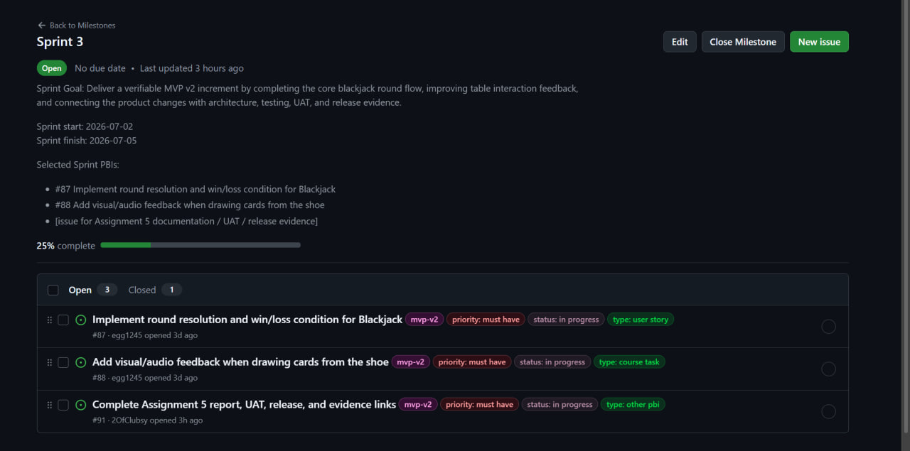
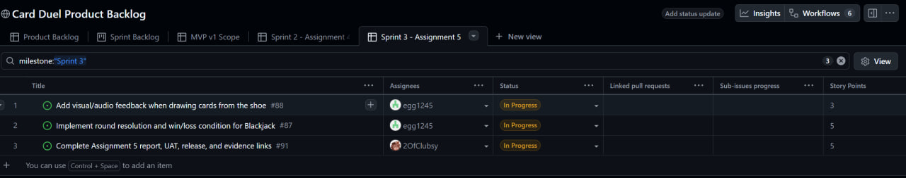
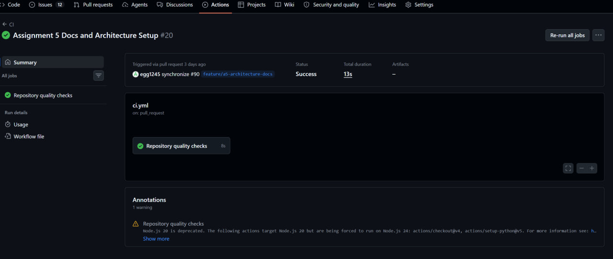
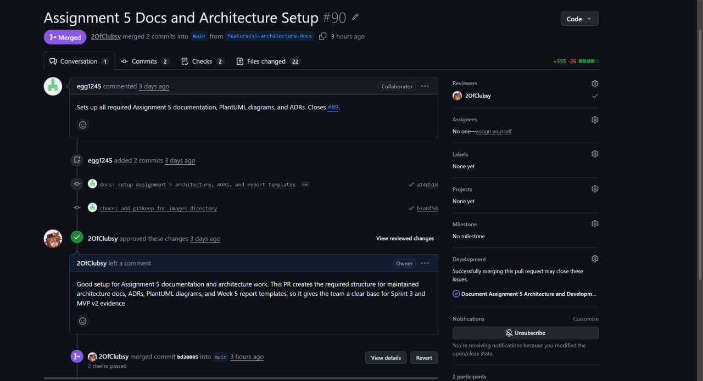
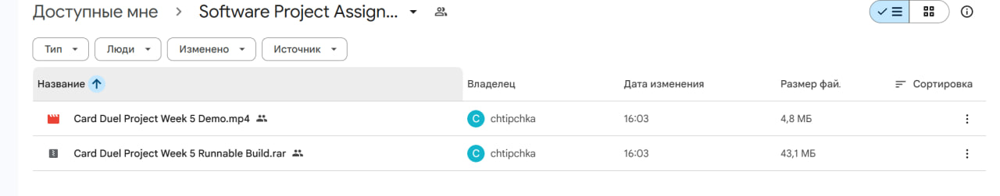

# Week 5 Report — Card Duel Project

## 1. Project overview

**Project name:** Card Duel Project  
**Team:** Team #31  
**Sprint:** Sprint 3 — Assignment 5  
**Target increment:** MVP v2

Card Duel Project is a 3D card-duel game prototype focused on table-centered card interaction and blackjack-inspired gameplay. Sprint 3 focused on delivering a more complete MVP v2 increment and maintaining Assignment 5 evidence: architecture documentation, ADR traceability, development process documentation, UAT preparation, release evidence, screenshots, and public/private evidence separation.

---

## 2. Sprint 3 planning

| Item | Link |
|---|---|
| Product Backlog board/view | [Product Backlog](https://github.com/users/2OfClubsy/projects/1/views/1) |
| Sprint 3 Backlog board/view | [Sprint 3 Backlog](https://github.com/users/2OfClubsy/projects/1/views/5) |
| Sprint 3 milestone | [Sprint 3 milestone](https://github.com/2OfClubsy/card-duel-project/milestone/4) |
| Sprint dates | Week 5 / Assignment 5 Sprint |
| Total Sprint size | 13 Story Points |

### Sprint Goal

Deliver a verifiable MVP v2 increment by completing the core blackjack round flow, improving table interaction feedback, and connecting the product changes with architecture, testing, UAT, and release evidence.

### Selected Sprint 3 scope

| Issue | Title | Story Points | Implementer | Reviewer | Status |
|---|---|---:|---|---|---|
| [#87](https://github.com/2OfClubsy/card-duel-project/issues/87) | Implement round resolution and win/loss condition for Blackjack | 5 | Danil | Arthur / team reviewer | In Progress / Done after implementation merge |
| [#88](https://github.com/2OfClubsy/card-duel-project/issues/88) | Add visual/audio feedback when drawing cards from the shoe | 3 | Danil | Arthur / team reviewer | In Progress / Done after implementation merge |
| [#91](https://github.com/2OfClubsy/card-duel-project/issues/91) | Complete Assignment 5 report, UAT, release, and evidence links | 5 | Arthur | Danil | In Progress |

---

## 3. MVP v2 delivered changes

During Sprint 3, the team improved the blackjack gameplay loop and prepared the project evidence for Assignment 5.

### Gameplay changes

- Added random initial card dealing instead of using one fixed starting card.
- Updated card draw logic so newly drawn cards are added to the hand and the total score is calculated correctly.
- Added bust/loss detection when the player's total exceeds 21.
- Added pass/end-turn behavior, allowing the player to finish the turn.
- Added dealer turn after the player passes.
- Added win/loss resolution after comparing the player and dealer results.
- Added the ability to start a new game after the previous round ends.
- Added new 3D models for the room, cabinet, small table, and box, which are planned to support future puzzle interactions.

### Documentation and evidence changes

- Updated architecture documentation with static, dynamic, and deployment views.
- Strengthened ADR traceability with related quality requirements.
- Updated the development process and configuration-management documentation.
- Updated the roadmap for Sprint 3, MVP v2, and the next expected increment.
- Updated UAT scenarios for MVP v2 gameplay verification.
- Added hosted documentation entry point.
- Added Week 5 screenshots and public evidence structure.
- Updated LLM report, reflection, retrospective, and changelog.

---

## 4. Product access and demo

| Artifact | Link |
|---|---|
| Product access artifact / MVP v2 build | [Google Drive folder](https://drive.google.com/drive/folders/1Nw1Wg9QzIJyZzXM1cbRJmDAVqr3V5eNB?usp=sharing) |
| Public sanitized demo video | [Google Drive folder](https://drive.google.com/drive/folders/1Nw1Wg9QzIJyZzXM1cbRJmDAVqr3V5eNB?usp=sharing) |
| Current run instructions | [Root README](../../README.md) |

The Google Drive folder contains the public demo video and the MVP v2 build / product access artifact.

---

## 5. Customer feedback response

| Feedback point | Resulting PBI or issue | Status | Response |
|---|---|---|---|
| Continue the project as a 3D card-duel experience, not a simple 2D prototype. | ADR-0002 and MVP v2 product direction | Maintained | The team kept the 3D lobby and table interaction as the core product direction. |
| Complete the blackjack system before presenting MVP v2 as fully working. | [#87](https://github.com/2OfClubsy/card-duel-project/issues/87) | Addressed in Sprint 3 work | The team added blackjack round progress, pass/end-turn behavior, dealer turn, bust detection, win/loss resolution, and new game restart. |
| Improve table card interaction feedback. | [#88](https://github.com/2OfClubsy/card-duel-project/issues/88) | Addressed in Sprint 3 work | The team improved the card draw interaction direction and prepared UAT coverage for this behavior. |

### Feedback not addressed

No high-priority MVP v1 feedback was intentionally ignored. Future visual polish, atmosphere, and deeper opponent behavior remain candidates for MVP v3.

---

## 6. Maintained documentation links

| Artifact | Link |
|---|---|
| Roadmap | [`docs/roadmap.md`](../../docs/roadmap.md) |
| Definition of Done | [`docs/definition-of-done.md`](../../docs/definition-of-done.md) |
| Testing documentation | [`docs/testing.md`](../../docs/testing.md) |
| Quality requirements | [`docs/quality-requirements.md`](../../docs/quality-requirements.md) |
| Quality requirement tests | [`docs/quality-requirement-tests.md`](../../docs/quality-requirement-tests.md) |
| User acceptance tests | [`docs/user-acceptance-tests.md`](../../docs/user-acceptance-tests.md) |
| Development process | [`docs/development-process.md`](../../docs/development-process.md) |
| Architecture documentation | [`docs/architecture/README.md`](../../docs/architecture/README.md) |
| Changelog | [`CHANGELOG.md`](../../CHANGELOG.md) |

---

## 7. Architecture evidence

| Architecture artifact | Link |
|---|---|
| Architecture overview | [`docs/architecture/README.md`](../../docs/architecture/README.md) |
| Static view — component diagram | [`docs/architecture/static-view/component-diagram.puml`](../../docs/architecture/static-view/component-diagram.puml) |
| Dynamic view — sequence diagram | [`docs/architecture/dynamic-view/sequence-diagram.puml`](../../docs/architecture/dynamic-view/sequence-diagram.puml) |
| Deployment view — deployment diagram | [`docs/architecture/deployment-view/deployment-diagram.puml`](../../docs/architecture/deployment-view/deployment-diagram.puml) |
| ADR directory | [`docs/architecture/adr/`](../../docs/architecture/adr/) |

### Architecture summary

The architecture documentation explains the product through three maintained views.

The static view explains the main Godot scenes, scripts, interaction components, UI elements, and card resources. The dynamic view explains the card draw flow as a core gameplay scenario. The deployment view explains how the Godot project and build artifact are delivered for customer and instructor review.

### Quality requirements and ADR links

The architecture decisions are linked to maintained quality requirements:

- ADR-0001 supports documentation maintainability, traceability, and reviewability.
- ADR-0002 supports the customer-requested 3D table interaction direction.
- ADR-0003 supports card data modifiability and future card-system extension.

---

## 8. Testing and CI status

| Evidence | Link |
|---|---|
| CI pipeline | [GitHub Actions](https://github.com/2OfClubsy/card-duel-project/actions) |
| Latest successful CI run | [CI run](https://github.com/2OfClubsy/card-duel-project/actions/runs/28597583536) |
| Testing documentation | [`docs/testing.md`](../../docs/testing.md) |
| Quality requirement tests | [`docs/quality-requirement-tests.md`](../../docs/quality-requirement-tests.md) |

### Testing summary

Sprint 3 verification combines CI checks, documentation review, manual verification, and customer UAT. Product changes are verified through the MVP v2 build and demo evidence, while documentation and repository evidence are checked through Markdown review, link review, screenshots, and public/private evidence separation.

---

## 9. Release evidence

| Item | Link |
|---|---|
| SemVer release mapped to Assignment 5 / MVP v2 | Pending after merge: GitHub Release `v0.3.0` |
| Product access artifact | [Google Drive folder](https://drive.google.com/drive/folders/1Nw1Wg9QzIJyZzXM1cbRJmDAVqr3V5eNB?usp=sharing) |
| Public sanitized demo video | [Google Drive folder](https://drive.google.com/drive/folders/1Nw1Wg9QzIJyZzXM1cbRJmDAVqr3V5eNB?usp=sharing) |
| Changelog | [`CHANGELOG.md`](../../CHANGELOG.md) |

The GitHub release `v0.3.0` must be created after the final Assignment 5 changes are merged into the protected default branch.

---

## 10. User Acceptance Testing

| UAT artifact | Link / Status |
|---|---|
| Maintained UAT scenarios | [`docs/user-acceptance-tests.md`](../../docs/user-acceptance-tests.md) |
| Public UAT results summary | See `docs/user-acceptance-tests.md` after customer session update |
| Private UAT recording | Submitted privately through Moodle only |

### Public UAT summary

The Week 5 UAT scenarios focus on:

- blackjack round resolution;
- card draw feedback;
- 3D table interaction continuity.

Private UAT recording links, exact private timecodes, customer-identifying evidence, access credentials, and private consent evidence are not committed to the public repository.

---

## 11. Sprint Review

| Artifact | Link / Status |
|---|---|
| Sprint Review notes | [`reports/week5/sprint-review-notes.md`](./sprint-review-notes.md) |
| Sprint Review summary | [`reports/week5/sprint-review-summary.md`](./sprint-review-summary.md) |
| Private Sprint Review recording | Submitted privately through Moodle only |

The public repository contains only sanitized Sprint Review notes and summary. Private recordings, exact timecodes, and customer-identifying evidence are submitted privately.

---

## 12. Hosted documentation site

| Item | Link |
|---|---|
| Hosted documentation site | Pending after merge: GitHub Pages from the `docs/` folder |
| Hosted documentation source | [`docs/index.md`](../../docs/index.md) |

The hosted documentation site is published from the `docs/` folder using GitHub Pages after the final Assignment 5 changes are merged into `main`.

---

## 13. Required screenshots

Screenshots are stored in [`reports/week5/images/`](./images/).

| Screenshot | File |
|---|---|
| Sprint milestone | [`sprint3-milestone.png`](./images/sprint3-milestone.png) |
| Board / project workflow view | [`sprint3-board-view.png`](./images/sprint3-board-view.png) |
| Latest protected-default-branch CI run | [`latest-ci-run.png`](./images/latest-ci-run.png) |
| Example reviewed issue-linked PR | [`example-reviewed-pr.png`](./images/example-reviewed-pr.png) |
| Product access artifact / demo folder | [`product-access-artifact.png`](./images/product-access-artifact.png) |

### Screenshot evidence

#### Sprint 3 milestone

#### Sprint 3 board view

#### Latest CI run

#### Example reviewed PR

#### Product access artifact

---

## 14. Additional Week 5 artifacts

| Artifact | Link |
|---|---|
| Reflection | [`reports/week5/reflection.md`](./reflection.md) |
| Retrospective | [`reports/week5/retrospective.md`](./retrospective.md) |
| LLM report | [`reports/week5/llm-report.md`](./llm-report.md) |

---

## 15. Contribution traceability

| Team member | GitHub username | Week 5 contribution | Issues / PRs / evidence |
|---|---|---|---|
| Arthur | `2OfClubsy` | Assignment 5 documentation, architecture documentation support, ADR traceability, roadmap, README links, Week 5 report, screenshots, release/report evidence organization | [#91](https://github.com/2OfClubsy/card-duel-project/issues/91) |
| Danil | `egg1245` | Sprint 3 setup, GitHub workflow support, UAT/Sprint Review evidence support, documentation review | [#91](https://github.com/2OfClubsy/card-duel-project/issues/91) |
| Maria | `biphasicSleeper` | Implemented random initial card dealing and corrected score calculation when drawing additional cards | MVP v2 gameplay increment |
| Sergey | `SergeyUse` | Implemented bust/loss detection when the player exceeds 21, pass/end-turn behavior, dealer turn, and win/loss resolution | [#87](https://github.com/2OfClubsy/card-duel-project/issues/87), [#88](https://github.com/2OfClubsy/card-duel-project/issues/88) |
| Andrei | `AndreyBadamshin` | Added ability to start a new game after a round ends; added room, cabinet, small table, and box models for future puzzle interactions | MVP v2 gameplay and 3D asset increment |

---

## 16. Current product status

The current MVP v2 increment improves the blackjack gameplay loop and keeps the product aligned with the approved 3D card-duel direction. The repository also contains maintained Assignment 5 documentation for architecture, ADRs, development process, UAT, roadmap, quality requirements, testing, and public/private evidence handling.

The remaining finalization steps after merge are:

- create GitHub Release `v0.3.0`;
- enable GitHub Pages from the `docs/` folder;
- confirm the release and hosted documentation links are live;
- submit private recording links and exact access details through Moodle only.

---

## 17. Next steps

- Merge the final Assignment 5 PR after review and checks.
- Create the GitHub Release `v0.3.0`.
- Enable GitHub Pages from the `docs/` folder.
- Confirm that the public demo/build folder is accessible.
- Submit private Sprint Review and UAT recording evidence through Moodle only.
- Prepare the Moodle PDF with commit-hash permalinks, team table, contribution summary, private recording links, and private access instructions.
