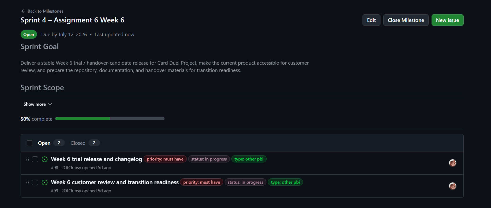
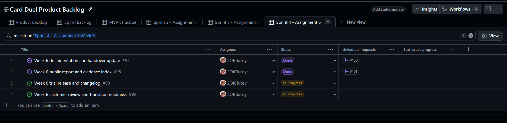
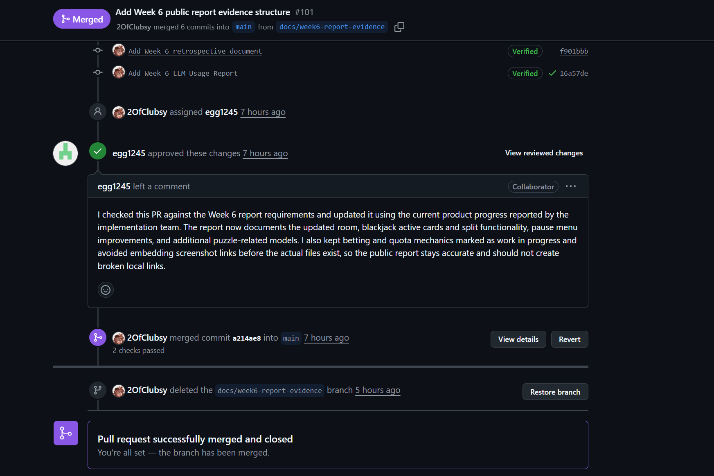
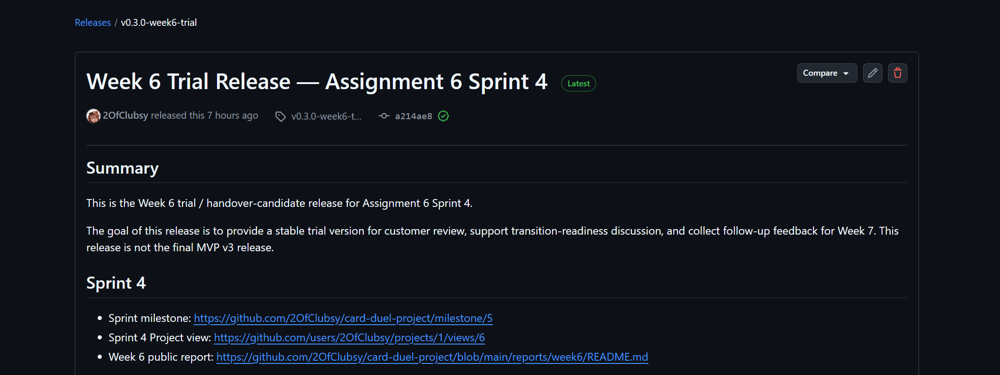
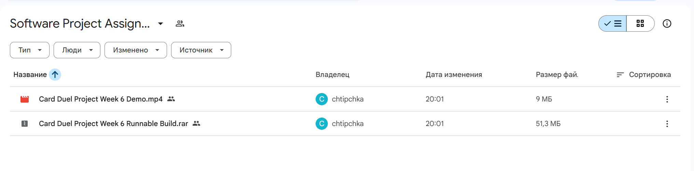
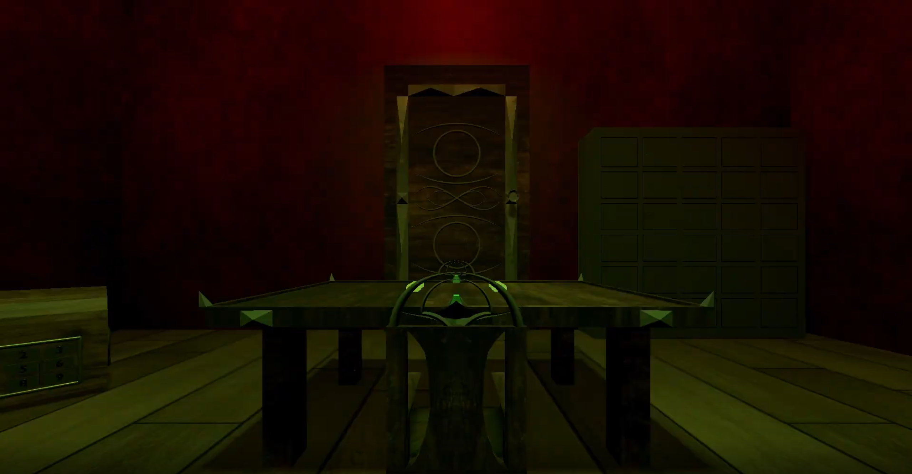

# Week 6 Report — Assignment 6 Sprint 4

## Project

**Card Duel Project**

Card Duel Project is a 3D card-duel game prototype developed as a customer-driven course project. The player enters a dark tabletop environment, interacts with a card table, and plays a blackjack-inspired duel round against the dealer.

Week 6 focuses on preparing a stable trial / handover-candidate version, reviewing customer-facing documentation, and preparing the product for transition-readiness discussion before Week 7 follow-up work.

## Public project links

| Artifact | Link |
|---|---|
| Product Backlog view | [Product Backlog](https://github.com/users/2OfClubsy/projects/1/views/1) |
| Sprint 4 Backlog view | [Sprint 4 Backlog](https://github.com/users/2OfClubsy/projects/1/views/6) |
| Sprint 4 milestone | [Sprint 4 – Assignment 6 Week 6](https://github.com/2OfClubsy/card-duel-project/milestone/5) |
| Repository README | [README.md](../../README.md) |
| Contributing guide | [CONTRIBUTING.md](../../CONTRIBUTING.md) |
| Agent guidance | [AGENTS.md](../../AGENTS.md) |
| Customer handover guide | [docs/customer-handover.md](../../docs/customer-handover.md) |
| Roadmap | [docs/roadmap.md](../../docs/roadmap.md) |
| Changelog | [CHANGELOG.md](../../CHANGELOG.md) |
| Hosted documentation site | https://2ofclubsy.github.io/card-duel-project/ |

## Sprint 4 summary

| Field | Value |
|---|---|
| Sprint | Sprint 4 |
| Assignment week | Assignment 6 Week 6 |
| Sprint goal | Deliver a stable Week 6 trial / handover-candidate release for Card Duel Project, make the current product accessible for customer review, and prepare the repository, documentation, and handover materials for transition readiness. |
| Sprint dates | TODO: add actual Sprint 4 start and finish dates |
| Total Sprint size | 12 Story Points |
| Sprint milestone | [Sprint 4 – Assignment 6 Week 6](https://github.com/2OfClubsy/card-duel-project/milestone/5) |
| Sprint backlog view | [Sprint 4 Backlog](https://github.com/users/2OfClubsy/projects/1/views/6) |

## Selected Sprint 4 scope

| Issue | Story Points | Implementer | Reviewer | Status |
|---|---:|---|---|---|
| [#95 — Week 6 documentation and handover update](https://github.com/2OfClubsy/card-duel-project/issues/95) | 4 | Arthur | Sergey | In progress |
| [#96 — Week 6 public report and evidence index](https://github.com/2OfClubsy/card-duel-project/issues/96) | 3 | Arthur | Danil | In progress |
| [#98 — Week 6 trial release and changelog](https://github.com/2OfClubsy/card-duel-project/issues/98) | 2 | Arthur | Danil | In progress |
| [#99 — Week 6 customer review and transition readiness](https://github.com/2OfClubsy/card-duel-project/issues/99) | 3 | Arthur | Maria | In progress |

## Week 6 product increment

The Week 6 product increment includes gameplay, environment, menu, and asset improvements prepared by the implementation team.

Visible Week 6 product changes:

- updated the main room where the card duel takes place;
- improved the blackjack system with active card usage;
- added split functionality to the blackjack system;
- started work on betting flow for blackjack rounds;
- started work on quota-related mechanics;
- improved the pause menu with settings and save options;
- added additional puzzle-related 3D models for future gameplay expansion.

Betting flow and quota-related mechanics are treated as work in progress during Week 6. They are included as development progress, but they should not be presented as fully completed stable customer-facing functionality until the implementation team confirms that they are ready.

## Week 6 trial-release summary

The Week 6 trial / handover-candidate release is intended to provide a stable version for customer review before final Week 7 follow-up work.

Current release status:

| Item | Status |
|---|---|
| Week 6 trial release | TODO: add release link after release is created |
| Product access artifact | TODO: add Week 6 build or access link |
| Run instructions | [README.md](../../README.md) and [docs/customer-handover.md](../../docs/customer-handover.md) |
| Changelog | [CHANGELOG.md](../../CHANGELOG.md) |

Expected Week 6 release purpose:

- provide a customer-accessible trial artifact;
- show the current Week 6 product increment;
- support customer documentation review;
- support transition-readiness discussion;
- collect feedback for Week 7 follow-up work;
- avoid presenting the Week 6 trial as final MVP v3.

## Current product access

| Access item | Link or status |
|---|---|
| Week 6 trial build | TODO: add Week 6 build or access link |
| Source repository | https://github.com/2OfClubsy/card-duel-project |
| Hosted documentation | https://2ofclubsy.github.io/card-duel-project/ |
| Customer handover guide | [docs/customer-handover.md](../../docs/customer-handover.md) |

Private credentials, exact private access instructions, private recordings, customer-identifying evidence, and private timecodes are not committed to the public repository. Required private evidence is provided only through the Week 6 Moodle PDF submission.

## Customer-facing documentation review

The Assignment 6 Week 6 documentation review covers:

- [README.md](../../README.md)
- [docs/customer-handover.md](../../docs/customer-handover.md)
- current access or run instructions;
- troubleshooting and support notes;
- known limitations;
- hosted documentation site.

Current documentation review status:

| Review area | Result |
|---|---|
| Repository entry point | TODO: summarize whether the README was clear to the customer |
| Handover guide | TODO: summarize whether the handover guide was clear |
| Access instructions | TODO: summarize whether the customer could understand how to access the trial artifact |
| Run instructions | TODO: summarize whether run steps were clear |
| Troubleshooting / support notes | TODO: summarize unclear or missing parts |
| Known limitations | TODO: summarize whether limitations were explained honestly |

## Transition-readiness summary

The Week 6 transition-readiness discussion should answer whether the product is ready for final transition after Week 7 follow-up work.

Current transition-readiness status:

| Question | Week 6 answer |
|---|---|
| Is the product complete enough for trial use? | TODO |
| Which parts are ready? | TODO |
| Which parts still need changes? | TODO |
| Is the customer already using the product? | TODO |
| Has the product been deployed or operated on the customer side? | TODO |
| What must happen in Week 7? | TODO |
| What would make the product more useful after final delivery? | TODO |

Expected Week 7 follow-up work will be finalized after the Week 6 customer trial and transition-readiness meeting.

## Customer feedback response table

| Feedback point | Source | Response | Resulting issue or action | Status |
|---|---|---|---|---|
| TODO | Week 6 customer review / trial | TODO | TODO | TODO |

Feedback not addressed during Week 6 will be explained here and converted into Week 7 follow-up work where appropriate.

## UAT / customer trial results

Relevant maintained UAT scenarios are stored in:

[docs/user-acceptance-tests.md](../../docs/user-acceptance-tests.md)

Week 6 customer trial / UAT summary:

| Scenario or trial activity | Result | Notes |
|---|---|---|
| Customer accesses the Week 6 trial artifact | TODO | TODO |
| Customer starts the product | TODO | TODO |
| Customer reaches the updated game room | TODO | TODO |
| Customer reaches the card-table interaction | TODO | TODO |
| Customer observes the blackjack round flow | TODO | TODO |
| Customer observes active card usage or split functionality | TODO | TODO |
| Customer reviews the pause menu changes | TODO | TODO |
| Customer reviews documentation for independent use | TODO | TODO |

Failed scenarios or unclear behavior will be converted into follow-up issues or explicit Week 7 transition actions.

## Maintained documentation updated during Sprint 4

| Document | Link | Purpose |
|---|---|---|
| README | [README.md](../../README.md) | Public repository entry point |
| Customer handover guide | [docs/customer-handover.md](../../docs/customer-handover.md) | Practical handover and transition-readiness guide |
| Roadmap | [docs/roadmap.md](../../docs/roadmap.md) | Current product direction and Week 6 / Week 7 path |
| Contributing guide | [CONTRIBUTING.md](../../CONTRIBUTING.md) | Human contributor workflow |
| Agent guidance | [AGENTS.md](../../AGENTS.md) | AI/tool-assisted contribution rules |
| Testing documentation | [docs/testing.md](../../docs/testing.md) | Verification approach |
| Quality requirements | [docs/quality-requirements.md](../../docs/quality-requirements.md) | Maintained quality requirements |
| Quality requirement tests | [docs/quality-requirement-tests.md](../../docs/quality-requirement-tests.md) | Quality verification evidence |
| Architecture documentation | [docs/architecture/README.md](../../docs/architecture/README.md) | Static, dynamic, and deployment architecture views |
| Development process | [docs/development-process.md](../../docs/development-process.md) | Maintained process documentation |

## Sprint Review evidence

| Artifact | Link or status |
|---|---|
| Public Sprint Review summary | [sprint-review-summary.md](sprint-review-summary.md) |
| Public Sprint Review notes | [sprint-review-notes.md](sprint-review-notes.md) |
| Private recording | Provided only through Week 6 Moodle PDF if available |
| Exact private timecodes | Provided only through Week 6 Moodle PDF if required |

The public repository contains only sanitized notes and summaries. Private recordings, exact timecodes, consent evidence, and customer-identifying details are not committed publicly.

## Reflection, retrospective, and LLM usage

| Artifact | Link |
|---|---|
| Week 6 reflection | [reflection.md](reflection.md) |
| Week 6 retrospective | [retrospective.md](retrospective.md) |
| Week 6 LLM report | [llm-report.md](llm-report.md) |

## Current product status

Current Week 6 status:

- the product is being prepared as a trial / handover-candidate version;
- the Week 6 increment includes room, blackjack, pause menu, and model improvements;
- betting and quota-related mechanics are still treated as work in progress;
- customer-facing documentation is being updated;
- handover guidance is being prepared;
- Sprint 4 evidence is being indexed in this report;
- Week 7 follow-up work will be refined after customer trial feedback.

The product is not yet marked as final MVP v3 during Week 6.

## Expected Week 7 follow-up work

Expected Week 7 follow-up categories:

- product fixes or usability improvements found during the Week 6 trial;
- verification or stabilization of betting and quota-related mechanics;
- documentation updates requested by the customer;
- access or run instruction fixes;
- final transition confirmation;
- final MVP v3 release preparation;
- final public report and demo evidence.

The exact Sprint 5 scope will be finalized after the Week 6 customer review and transition-readiness discussion.

## Contribution traceability

| Team member | GitHub username | Sprint 4 contribution | Issues / PRs | Review / evidence |
|---|---|---|---|---|
| Arthur | 2_Of_Clubsy | GitHub planning, Sprint 4 issue structure, public documentation, report structure, handover documentation, release evidence preparation | #95, #96, #98, #99, TODO: add PR links | TODO |
| Danil | egg1245 | GitHub and documentation support, report review, evidence structure support | TODO | TODO |
| Maria | biphasicSleeper | Main game development, blackjack system improvements, active card usage, split functionality, gameplay logic support | TODO | TODO |
| Sergey | SergeyUse | Game implementation support, 3D model work, puzzle-related model additions, implementation support | TODO | TODO |
| Andrei | AndreyBadamshin | Game implementation support, updated room/model work, additional puzzle-related 3D models | TODO | TODO |

Update this table after PRs, reviews, customer trial, and release evidence are completed.

## Public screenshots

Public sanitized screenshot evidence is stored in:

[reports/week6/images/](images/)

The screenshots below provide inspectable Week 6 evidence for Sprint 4 planning, reviewed work, release/access evidence, and the visible product increment.

| Screenshot | File | Purpose |
|---|---|---|
| Sprint 4 milestone | `images/sprint-4-milestone.png` | Shows that Sprint 4 exists as a formal Assignment 6 Week 6 milestone. |
| Sprint 4 Project view | `images/sprint-4-project-view.png` | Shows the Sprint 4 backlog view with selected Week 6 issues. |
| Example reviewed PR | `images/week6-reviewed-pr.png` | Shows issue-linked PR review evidence for Sprint 4. |
| Week 6 release | `images/week6-release.png` | Shows the Week 6 trial / handover-candidate release evidence. |
| Product access or build evidence | `images/week6-product-access.png` | Shows public-safe evidence of product access or build availability. |
| Updated game room | `images/week6-updated-room.png` | Shows the updated room where the card duel takes place. |

### Sprint 4 milestone

### Sprint 4 Project view

### Example reviewed PR

### Week 6 release

### Product access or build evidence

### Updated game room

